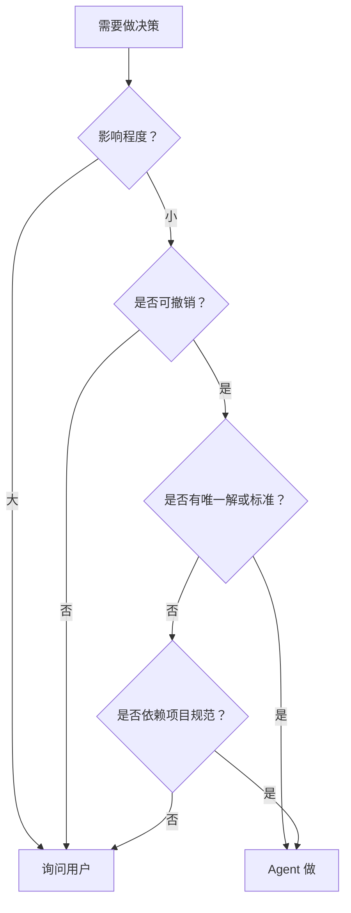
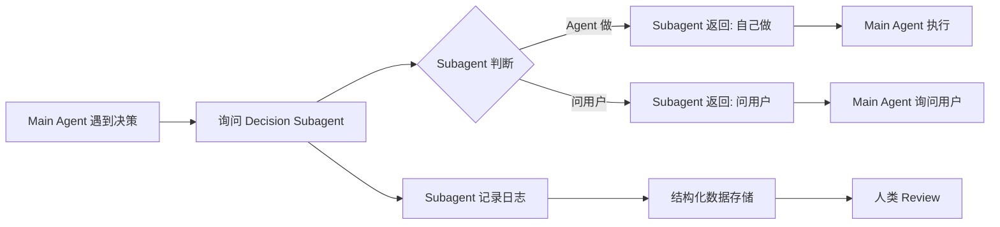

:page/title "Agent 自主性：如何划分决策边界"
:page/description "探讨 AI agent 的自主性 spectrum，讨论 agent 如何判断哪些决策应该自己做，哪些应该由用户来做"
:page/date "2026-02-03"
:blog-post/tags [:agent :AI :decision-making]
:blog-post/author {:person/id :jan}
:page/body

## 背景

在使用 AI agent 的过程中，一个核心问题是：**agent 应该有多少自主性？**

自主性太低：
- 用户说"改一下 header 背景色"
- Agent 问"改成什么颜色？"
- 用户觉得 agent 太啰嗦

自主性太高：
- 用户说"改一下背景色"
- Agent 自己改成了一个颜色
- 用户觉得"怎么没问我？"

真正的问题是：**agent 如何判断哪些决策应该自己做，哪些决策应该由用户来做？**

## 决策维度分类

### 维度 1：影响程度 + 可撤销性

| 决策类型 | 示例 | 影响程度 | 可撤销性 | 谁来做？ |
|---------|------|---------|---------|---------|
| 技术实现（小影响） | "用什么算法排序？" | 小 | 高 | Agent |
| 技术实现（小影响） | "代码格式用 2 空格还是 4？" | 小 | 高 | Agent |
| 技术实现（大影响） | "用什么 HTTP 库？" | 大（性能、兼容性） | 中 | 用户 |
| 技术实现（大影响） | "用什么数据库？" | 大（架构） | 低 | 用户 |
| 功能需求 | "这个功能需要哪些字段？" | 大 | 中 | 用户 |
| 功能需求 | "这个错误提示写什么？" | 小 | 高 | Agent（如果遵循现有风格） |

**原则**：影响大或不可撤销 → 用户；影响小且可撤销 → Agent

### 维度 2：明确性 vs 权衡

| 决策类型 | 示例 | 解的数量 | 谁来做？ |
|---------|------|---------|---------|
| 标准化决策 | "日期用什么格式？" | 1 个（ISO 8601） | Agent |
| 标准化决策 | "错误码用 400 还是 403？" | 1 个（有语义） | Agent |
| 审美决策 | "用什么字体？" | N 个（主观） | 用户 |
| 审美决策 | "背景色选什么？" | N 个（主观） | 用户 |
| 策略决策 | "缓存过期时间多久？" | N 个（业务权衡） | 用户 |

**原则**：唯一解 → Agent；多解（尤其是主观解）→ 用户

### 维度 3：可撤销性

| 决策类型 | 示例 | 可撤销性 | 谁来做？ |
|---------|------|---------|---------|
| 代码结构 | "这个函数拆成几个？" | 低（重构成本高） | 用户 |
| API 设计 | "这个 endpoint 接受哪些参数？" | 低（breaking change） | 用户 |
| 配置调整 | "日志级别改成 DEBUG？" | 高（随时可改） | Agent |
| 代码格式 | "用 2 空格还是 4 空格？" | 高（工具自动） | Agent |

**原则**：不可撤销或撤销成本高 → 用户；可撤销 → Agent

### 维度 4：上下文依赖

| 决策类型 | 示例 | 上下文依赖 | 谁来做？ |
|---------|------|-----------|---------|
| 遵循现有风格 | "变量名用 snake_case 还是 camelCase？" | 高（依赖项目规范） | Agent |
| 遵循现有架构 | "这个模块放在哪个目录？" | 高（依赖项目结构） | Agent |
| 业务逻辑 | "这个错误该返回 401 还是 403？" | 高（依赖业务规则） | 用户 |
| 业务逻辑 | "这个功能是否需要权限控制？" | 高（依赖业务需求） | 用户 |

**原则**：技术上下文依赖 → Agent（遵循现有规范）；业务上下文依赖 → 用户

## Agent 决策判断流程



### 判断流程简化版

1. **影响程度如何？**
   - 大（如架构决策、技术选型）→ 询问用户
   - 小 → 继续

2. **是否可撤销？**
   - 否（如 API 设计、代码结构）→ 询问用户
   - 是 → 继续

3. **是否有唯一解或标准？**
   - 是（如日期格式、错误码语义）→ Agent 做
   - 否 → 继续

4. **是否依赖项目规范？**
   - 是（如代码风格、现有架构模式）→ 遵循规范，Agent 做
   - 否 → 询问用户

## 实践建议

### Agent 自主性配置

可以给 agent 提供一个自主性配置：

```clojure
{:autonomy-level :medium ;; :low, :medium, :high
 :rules
 {:low-impact-decisions :agent
  :high-impact-decisions :user
  :reversible-decisions :agent
  :irreversible-decisions :user
  :standard-choices :agent
  :project-conventions :agent
  :business-decisions :user
  :aesthetic-decisions :user}}
```

### 自主性 Spectrum

```
Low ←──────────────────────────── High
"每步都问"    "智能判断决策边界"
```

| 自主性 | 行为 | 适用场景 |
|--------|------|---------|
| Low | 所有决策都问用户 | 新手用户、高风险场景 |
| Medium | 技术决策自己做，业务决策问用户 | 大多数场景 |
| High | 除了高风险决策外都自己做 | 熟练用户、快速迭代 |

### 避免"假自主性"

**假自主性**：
- Agent 问"你想用 A 还是 B？"，但 A 和 B 没有本质区别
- Agent 提供多个方案让用户选，但没有说明每个方案的影响

**真自主性**：
- Agent 识别决策边界，自己能做的直接做
- 必须问用户时，说明为什么需要用户决策
- 提供方案时，说明每个方案的权衡

## 示例

### 示例 1：代码重构

**用户指令**："这个函数太长了，拆一下"

**低自主性 Agent**：
"你想拆成几个函数？每个函数负责什么？"

**高自主性 Agent**：
直接拆分，遵循单一职责原则

**理想 Agent**：
"这个函数有 50 行，我建议拆成 3 个函数：
1. `validate-input` - 验证输入
2. `process-data` - 处理数据
3. `format-output` - 格式化输出

是否按这个方式拆分？"

（影响中等，可撤销但重构有成本，提供建议让用户确认）

### 示例 2：添加错误处理

**用户指令**："这个函数需要错误处理"

**低自主性 Agent**：
"错误应该怎么处理？返回 null？抛异常？返回错误对象？"

**高自主性 Agent**：
直接添加错误处理，使用项目现有的错误处理模式

**理想 Agent**：
直接添加错误处理，遵循项目现有的错误处理模式（影响小，遵循项目规范，agent 做）

### 示例 3：修改 UI 样式

**用户指令**："改一下 header 背景色"

**低自主性 Agent**：
"改成什么颜色？"

**高自主性 Agent**：
直接改成蓝色

**理想 Agent**：
"你想改成什么颜色？还是参考现有的配色方案？"（影响小，但主观审美，问用户）

### 示例 4：API 设计

**用户指令**："添加一个获取用户信息的 API"

**低自主性 Agent**：
"这个 API 需要返回哪些字段？需不需要分页？需不需要缓存？"

**高自主性 Agent**：
直接设计返回所有字段，不加缓存

**理想 Agent**：
"这个 API 需要返回哪些用户信息？是否需要分页？是否需要缓存？"（影响大，不可撤销，问用户）

### 示例 5：选择 HTTP 库

**用户指令**："这个项目需要发送 HTTP 请求"

**低自主性 Agent**：
"想用什么 HTTP 库？"

**高自主性 Agent**：
直接选择一个流行的库

**理想 Agent**：
"想用什么 HTTP 库？我可以推荐几个选项：
- X: 轻量级，适合简单场景
- Y: 功能丰富，适合复杂场景
- Z: 遵循项目现有风格

需要我推荐吗？"（影响大，多个选项有不同权衡，询问用户）

## 挑战和局限

### 决策边界的模糊性

很多决策落在边界上，难以明确分类：

- "这个函数应该叫什么名字？" —— 影响小，但涉及可读性和维护性
- "这个错误提示应该写什么？" —— 影响小，但可能影响用户体验
- "缓存过期时间多久？" —— 可撤销，但有性能影响

### 影响程度的判断困难

Agent 难以准确判断决策的影响程度：

- 选择 HTTP 库：Agent 可能不知道这个库在团队中是否有人熟悉
- 代码格式：看似影响小，但影响整个项目的可维护性
- API 设计：看似影响大，但如果项目内部使用，改起来成本不高

### 用户偏好差异

不同用户对自主性的需求不同：

- 新手用户：希望 agent 多问，避免犯错
- 熟练用户：希望 agent 多做，减少交互成本
- 不同场景：高风险场景需要多问，快速迭代场景需要少问

### 上下文理解的不完整

Agent 可能缺少完整的上下文，导致错误判断：

- 项目有隐含的业务规则，agent 不知道
- 用户有自己的编码习惯，agent 不知道
- 有一些历史原因导致某种方案不可行，agent 不知道

## 架构设计：Decision Subagent

### Motivation

Main agent 面临的难题：
- 如何判断一个决策应该由自己做还是问用户？
- 决策判断逻辑如果分散在各处，难以维护和改进
- 缺少结构化记录，人类无法 review 决策历史

### Solution：Decision Subagent

创建一个专门的 subagent，负责决策边界判断。

#### 架构流程



#### 引入 Subagent 带来的新问题

1. **触发时机难把握**：main agent 遇到决策时，什么时候应该调用 subagent？
2. **容易忘记调用**：main agent 做决策时可能忘记问 subagent
3. **上下文传递复杂**：问 subagent 时应该包含多少上下文？如果思考太多"怎么提问"会浪费算力

这些问题的解决方案还在探索中，目前还没有验证过有效的方法。

#### Decision Record 结构

```json
{
  "id": "decision_123",
  "timestamp": "2026-02-03T10:00:00Z",
  "main_agent_id": "agent_main",
  "decision_description": "选择 HTTP 库",
  "context": {
    "user_command": "添加一个发送 HTTP 请求的功能",
    "project_tech_stack": ["Clojure", "ClojureScript"],
    "available_options": ["clj-http", "hato", " cljs-http"]
  },
  "subagent_analysis": {
    "impact_level": "high",
    "reversible": "false",
    "has_unique_solution": "false",
    "depends_on_project_convention": "false",
    "conclusion": "ask_user",
    "reasoning": "影响大，不可撤销，无唯一解，多个选项有不同权衡"
  },
  "subagent_decision": "ask_user",
  "user_feedback": null
}
```

#### 人类 Review 流程

1. 人类定期 review decision records
2. 对错误的判断提供反馈
3. Subagent 从反馈中学习
4. 更新决策判断逻辑

#### 优势

- **集中管理**：决策边界逻辑集中在一个 subagent
- **可追溯**：每个决策都有记录和判断依据
- **可改进**：通过人类反馈不断优化判断逻辑
- **数据驱动**：长期积累可以分析决策模式

## 思考问题

有没有什么工程化的方式可以解决 main agent 忘记调用 subagent 的问题？

## 未来方向

- 自主性自适应：根据用户历史偏好调整自主性
- 决策学习：从人类的决策中学习决策模式
- 上下文增强：agent 主动收集更多上下文信息
- 决策解释：agent 说明为什么选择某个方案
- Subagent 训练：使用 decision records 训练更高效的模型

## 参考

- 关于 agent trace 分析的讨论，见 [agent-self-reflection-trace-analysis](./agent-self-reflection-trace-analysis.md)
