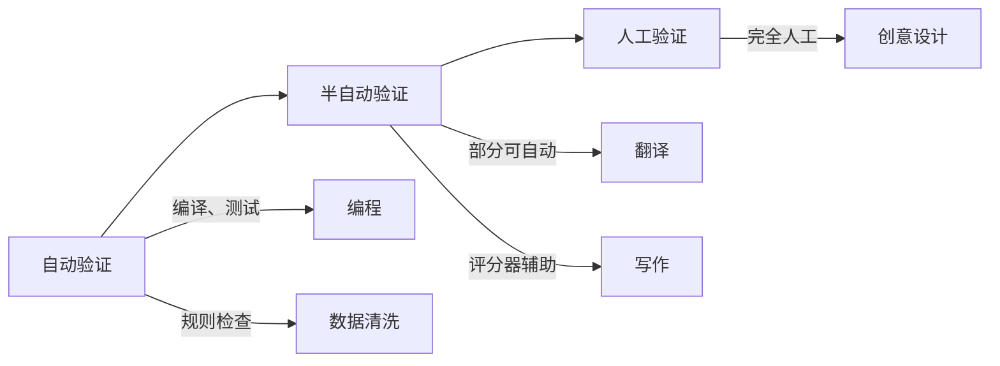
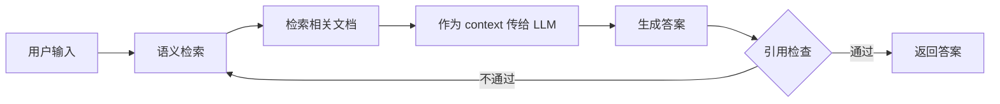
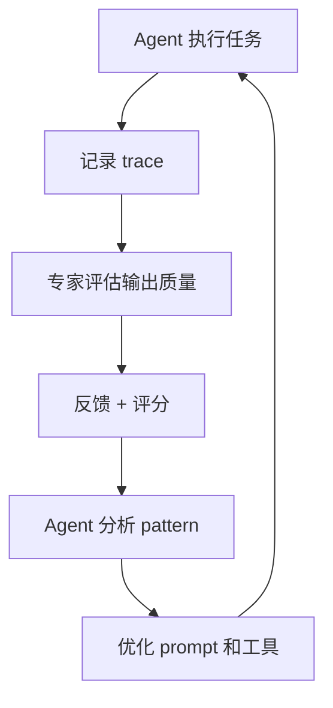

# Agent 在非编码领域的应用：挑战与机会

## 背景

目前最成熟的 AI Agent 应用集中在编程领域（如 opencode、Cursor、GitHub Copilot 等），而非编码的 intellectual work 领域却鲜有垂直领域的 Agent 产品。

这个现象背后的核心问题是什么？

## 问题一：领域专家的错误期望

### 症状

领域专家对 AI 能力边界不了解：

- 不知道 AI 能做什么、不能做什么
- 不清楚哪些任务 AI 容易做好，哪些不容易做好
- 对 AI 的能力有过度或不足的期望

### 错误期望的后果

#### 1. 资源浪费

- 在 AI 无法胜任的任务上投入大量时间调试
- 过度试错导致 token 成本失控
- 项目进度因反复尝试而延误

#### 2. 信心丧失

- 当 AI 无法满足期望时，专家认为"AI 没用"
- 抛弃 AI 工具，回到传统工作方式
- 丧失后续探索 AI 应用的动力

#### 3. 责任归属混乱

- 项目失败时，是 AI 的问题还是任务设计的问题？
- 无法区分"任务不适合 AI"和"AI 能力不足"
- 缺少复盘和改进的机会

#### 4. 领域知识退化

- 过度依赖 AI 而不再深入思考
- 专业判断能力下降
- 难以评价 AI 输出的质量

#### 5. 工作流程适配成本高

- 传统工作流程与 AI 能力不匹配
- 强行适配导致效率反而降低
- 缺少"AI native"的工作方式

## 问题二：技术人员的 Bridge 挑战

### 技术人员需要做什么？

要构建一个垂直领域的 Agent，技术人员需要：

1. **理解领域知识**
   - 阅读领域文档，掌握核心概念和术语
   - 理解领域专家的工作流程和决策点
   - 识别哪些环节可以标准化，哪些需要专业判断

2. **理解 AI 能力边界**
   - 知道哪些任务 AI 擅长
   - 知道哪些任务 AI 不擅长

3. **设计"AI native"的工作流**
   - 不是简单地把传统工作流搬到 AI 上
   - 而是根据 AI 能力重新设计工作方式

### Bridge 的难点

| 难点 | 具体表现 |
|------|---------|
| 知识获取成本高 | 领域文档可能不完整，需要与专家大量对话 |
| 隐性知识难提取 | 专家"凭直觉"做出的判断，难以显式化 |
| 领域特异性强 | 不同领域的工作方式差异巨大 |
| 评估标准模糊 | 非编程领域的质量标准往往主观 |

## 问题三：验证成本决定 AI 适用性

### 核心洞察

AI 在某些任务上表现优异，关键因素不是任务的"复杂度"，而是**验证成本**。

**验证成本低** → AI 可以自动检查、重试，不需要人类介入
**验证成本高** → 需要人类逐行审查，效率提升有限

### 示例对比

| 任务类型 | 验证方式 | AI 适用性 | 原因 |
|---------|---------|---------|------|
| 编写算法 | 运行 test case | ✅ 高 | 自动化验证，可反复重试 |
| 数据清洗 | 定义验证规则 | ✅ 高 | 自动化检查 |
| 写作 | 逐句审查 | ❌ 低 | 需要人类阅读，成本高 |
| 创意设计 | 主观评价 | ❌ 低 | 没有明确标准 |

### 检查容易的工作领域

#### 1. 编程相关（最成熟）

| 任务 | 验证方式 | 工具支持 |
|------|---------|---------|
| 算法实现 | Test case | 测试框架 |
| 代码重构 | 编译 + Linter | 编译器、静态分析 |
| 类型系统 | Type checker | 类型检查器 |
| API 设计 | Contract testing | 测试工具 |
| 性能优化 | Benchmark | 性能分析工具 |

#### 2. 数据处理

| 任务 | 验证方式 | 示例 |
|------|---------|------|
| 数据清洗 | Schema 验证 + 统计规则 | "所有 age 字段在 0-120 之间" |
| 数据转换 | 结构对比 | JSON → XML，验证字段映射 |
| 数据标注 | 规则验证 | 标注结果符合预定义的类别和格式 |
| 数据去重 | 一致性检查 | 检查重复记录 |
| 数据补全 | 空值率检查 | 确保缺失值填充后数据完整 |

#### 3. 格式转换

| 任务 | 验证方式 | 示例 |
|------|---------|------|
| 文档格式转换 | 结构对比 | Markdown → HTML，验证标题层级一致 |
| 表格转图表 | 数据一致性 | Excel → Chart，验证数据点对应 |
| 多媒体格式转码 | 质量/元数据验证 | MP4 → WebM，检查分辨率、时长 |
| 文件编码转换 | 字符验证 | GBK → UTF-8，验证无乱码 |

#### 4. 翻译（有限场景）

| 场景 | 验证方式 | 示例 |
|------|---------|------|
| 技术文档翻译 | Terminology check | 确保专业术语翻译一致 |
| UI 文案翻译 | Length check | 确保翻译后字符串长度不超过 UI 限制 |
| 反向翻译验证 | 可读性检查 | 翻译后反向翻译，检查语义偏差（不完美但可用） |

#### 5. 配置管理

| 任务 | 验证方式 | 示例 |
|------|---------|------|
| 配置文件生成 | Schema validation | JSON/YAML 配置符合预定义 schema |
| 环境变量设置 | 类型检查 | PORT 必须是数字 |
| CI/CD 配置 | Dry run | 不实际执行，只验证配置语法 |
| Kubernetes 配置 | kubectl apply --dry-run | 验证 YAML 语法和 API 版本 |

#### 6. 文档生成（部分场景）

| 场景 | 验证方式 | 示例 |
|------|---------|------|
| API 文档生成 | 代码同步 | 文档和代码 API 签名一致 |
| 代码注释生成 | 格式检查 | 符合团队注释风格（如 Javadoc） |
| README 生成 | 必填项检查 | 包含项目描述、安装步骤等 |
| 测试用例生成 | 可执行性检查 | 生成的测试可以运行（不保证正确性） |

#### 7. 内容整理

| 任务 | 验证方式 | 示例 |
|------|---------|------|
| 会议记录整理 | 格式规范 | 包含时间、参与者、议程、决议 |
| 邮件分类 | 规则验证 | 分类标签符合预定义类别 |
| 日志分析 | 模式匹配 | 识别特定错误模式出现次数 |
| 任务优先级排序 | 一致性检查 | 按截止日期或紧急程度排序 |

#### 8. 知识图谱构建

| 任务 | 验证方式 | 示例 |
|------|---------|------|
| 实体抽取 | Schema 验证 | 抽取的实体属于预定义类型 |
| 关系抽取 | 方向性检查 | 确保关系的主体和客体正确 |
| 属性填充 | 类型验证 | 年龄属性必须是数字 |
| 图连通性 | 孤立节点检查 | 检查是否有未连接的实体 |

#### 9. 测试相关工作

| 任务 | 验证方式 | 示例 |
|------|---------|------|
| 单元测试生成 | 语法检查 | 生成的测试代码可编译 |
| 测试数据生成 | 边界检查 | 生成的测试数据覆盖边界值 |
| Mock 数据生成 | 格式验证 | Mock 数据符合 API schema |
| E2E 测试编写 | 可执行性 | 测试可以运行（不一定通过） |

### 检查困难的工作领域

| 任务 | 验证困难的原因 | 改进方向 |
|------|---------------|---------|
| 写作 | 需要人类阅读每一句，主观性强 | 使用评分器（如金字塔原理）降低成本 |
| 创意设计 | 没有明确标准，依赖审美和用户体验 | 通过 A/B 测试部分验证 |
| 策略制定 | 需要等待实际执行结果才能验证 | 使用模拟器提前测试 |
| 谈判和沟通 | 结果依赖对方的反应和态度 | 使用 AI 模拟对手练习 |
| 教学内容创作 | 需要学生反馈才能验证质量 | 收集学生反馈形成评分标准 |

### 验证成本谱系



### 启示

1. **优先选择验证成本低的领域** 构建垂直 Agent
2. **如果验证成本高**，考虑：
   - 降低验证标准（从"完美"到"可用"）
   - 引入半自动验证（如评分器）
   - 设计"AI + Human"的协作模式，而非完全替代
3. **对于验证成本极高的领域**，短期内不要期待 AI 完全替代人类

## 问题四：缺少"Agent Native"的知识整理框架

### 编程领域的优势

编程领域之所以 Agent 发达，一个关键原因是**基础设施完善**：

- **结构化代码**：函数、类、模块，易于解析
- **自动化工具**：test、linter、formatter、type checker
- **明确的反馈**：编译错误、测试失败、类型错误
- **版本控制**：git 提供完整的修改历史

这些构成了一个"Agent Native"的开发环境。

### 非 coding 领域的现状

相比之下，非 coding 领域往往缺少这样的基础设施：

- **知识分散**：文档、邮件、聊天记录、PPT 等形式混杂
- **缺少结构**：缺少统一的元数据、标签、分类体系
- **反馈延迟**：写作、研究的质量需要人工评价
- **版本管理弱**：没有像 git 那样的版本控制系统

### 潜在的"Agent Native"知识框架

#### 1. Zettelkasten 结构

- 每个知识单元独立
- 通过链接相互关联
- 支持多维度的搜索和检索

参考：[agent-questioning](./agent-questioning.md) 中提到的链接价值

#### 2. Schema 化的知识组织

```
{
  "id": "note_abc",
  "type": "concept",
  "tags": ["machine-learning", "transformer"],
  "links": ["note_xyz", "note_123"],
  "content": "...",
  "created_at": "...",
  "updated_at": "..."
}
```

#### 3. 层次化的知识分类

- 概念（concept）
- 方法（method）
- 案例（case）
- 反模式（anti-pattern）
- 决策点（decision）

#### 4. 可验证的输出格式

类似于代码测试，知识工作也需要可验证的机制：

- **Fact check**：生成的内容是否与现有知识一致？
- **Reference check**：是否引用了相关资料？
- **Logic check**：论证过程是否有逻辑漏洞？

## 问题五：如何让 AI 输出 Ground 到领域知识？

### Grounding 的挑战

如果领域已有文档，如何确保 AI 生成的内容是 ground 到这些文档上的？

| 问题 | 可能的原因 |
|------|-----------|
| 产生幻觉 | AI 基于训练数据生成，而非严格检索 |
| 信息过时 | 文档更新后，AI 缓存未刷新 |
| 上下文理解偏差 | 对领域术语的理解不准确 |
| 跨文档冲突 | 多个文档说法不一致 |

### Grounding 策略

#### 1. RAG（Retrieval-Augmented Generation）



#### 2. 强制引用

- 要求 AI 在生成内容时引用文档来源
- 用 `[@doc_id]` 形式标注
- 用户可点击链接查看原文

#### 3. 事后验证

```markdown
AI 生成的内容：
"根据 @doc_1 和 @doc_2，Transformer 的核心创新是 self-attention。"

验证步骤：
1. 检查 @doc_1 是否提到 self-attention
2. 检查 @doc_2 是否支持这个结论
3. 检查是否有遗漏的重要信息
```

#### 4. 层级化验证

- **L1：存在性验证**：引用的文档是否存在
- **L2：相关性验证**：文档是否真的包含相关信息
- **L3：准确性验证**：生成的内容是否与文档一致
- **L4：完整性验证**：是否遗漏了重要信息

## 问题六：为什么没有垂直领域的 Agent？

### 编程 vs 非编程领域的对比

| 维度 | 编程领域 | 非编程领域 |
|------|---------|-----------|
| **知识结构** | 结构化代码（函数、类、模块） | 非结构化文本、多媒体 |
| **工具生态** | test、linter、formatter、type checker | 缺少标准工具 |
| **反馈机制** | 编译错误、测试失败（即时反馈） | 人工评价（延迟反馈） |
| **评估标准** | 测试通过、类型安全 | 主观评价、多维度 |
| **标准化程度** | 语法规范、设计模式 | 工作方式因人而异 |
| **市场规模** | 全球开发者 | 细分领域、用户少 |
| **付费意愿** | 工具提升生产力，付费意愿高 | 不确定，ROI 难衡量 |

### 垂直领域 Agent 少的核心原因

#### 1. 市场碎片化

- 每个领域的知识结构和工具生态差异巨大
- 需要针对每个领域定制化开发
- 单个市场的规模有限

#### 2. 基础设施薄弱

- 缺少"Agent Native"的知识整理框架
- 缺少标准化的工具和反馈机制
- 知识大多以非结构化形式存在

#### 3. 评估困难

- 非编程领域的质量标准往往主观
- 难以像代码测试那样自动化验证
- 用户对"好"的定义差异很大

#### 4. 领域专家参与度低

- 领域专家可能不了解 AI 技术的潜力
- 技术人员可能缺乏领域知识
- 双方的沟通和协作成本高

#### 5. 投资回报不确定性

- 开发成本高（需要深入领域知识）
- 市场规模不确定
- ROI 难以衡量

## 机会：如何构建垂直领域 Agent？

### 策略一：从简单任务切入

不要一开始就想替代领域专家，而是：

| 复杂度 | 任务类型 | 示例 |
|--------|---------|------|
| 低 | 信息检索 | "找到所有关于 X 的文档" |
| 低 | 摘要生成 | "总结这篇论文的核心观点" |
| 中 | 格式转换 | "把这个会议记录整理成 Markdown" |
| 中 | 内容填充 | "根据大纲填充每个部分的详细内容" |
| 高 | 创新思考 | "提出一个新的研究方案" |

### 策略二：构建"Agent Native"知识库

#### 参考编程领域的做法

| 编程领域 | 知识领域 | 实现方式 |
|---------|---------|---------|
| 代码仓库 | 知识库 | 结构化的文档存储 |
| 单元测试 | Fact Check | 验证生成内容的一致性 |
| Linter | 风格检查 | 检查格式、术语使用 |
| Type Checker | 逻辑检查 | 验证论证的逻辑性 |
| CI/CD | 自动化工作流 | 自动化知识整理流程 |

#### 可能的知识整理框架

```clojure
{:knowledge-base
 {:schema
  {:id :string
   :type :enum [:concept :method :case :decision :anti-pattern]
   :title :string
   :tags [:string]
   :content :string
   :links [:string]
   :references [:string]
   :created-at :datetime
   :updated-at :datetime
   :confidence :float  ; 可信度分数
   :verified-by [:string]  ; 验证人列表
   :last-verified :datetime}

  :tools
  {:fact-checker {:fn verify-fact-against-knowledge-base}
   :style-checker {:fn check-format-and-terminology}
   :logic-checker {:fn validate-argument-structure}
   :reference-checker {:fn ensure-citations-are-accurate}

  :guardrails
  {:max-confidence-threshold 0.8
   :require-minimum-references 2
   :allow-hallucination? false}}}
```

### 策略三：设计合理的决策边界

参考 [agent-autonomy-decision-boundary](./agent-autonomy-decision-boundary.md) 的思路：

| 决策类型 | Agent | 领域专家 |
|---------|-------|---------|
| 信息检索 | 精确搜索 | 提供关键词 |
| 内容生成 | 填充结构化内容 | 确定结构和风格 |
| 结论验证 | Check 一致性 | 确认结论准确性 |
| 创新思考 | 提供相关案例 | 确定创新方向 |

### 策略四：渐进式增强

#### Stage 1：AI as Assistant

- Agent 执行简单任务（检索、摘要）
- 专家监督和修正
- 记录专家的反馈

#### Stage 2：AI as Collaborator

- Agent 处理中等复杂任务
- 专家审核输出质量
- 双方共同完成任务

#### Stage 3：AI as Expert（部分场景）

- 在特定任务上，Agent 达到专家水平
- 专家只需要在关键时刻介入
- 形成"Human-in-the-loop"的工作模式

### 策略五：建立反馈循环

参考 [agent-self-reflection-trace-analysis](./agent-self-reflection-trace-analysis.md)：



## 总结

### 核心挑战

1. **领域专家的错误期望** → 资源浪费、信心丧失
2. **技术人员的 Bridge 困难** → 知识获取成本高、隐性知识难提取
3. **缺少基础设施** → 没有"Agent Native"的知识整理框架
4. **Grounding 困难** → 如何确保 AI 输出准确、可靠
5. **市场碎片化** → 单个领域的市场规模有限

### 可能的解决方案

1. **从简单任务切入** → 逐步建立信任
2. **构建 Agent Native 知识库** → 模仿编程领域的基础设施
3. **设计合理的决策边界** → Agent 做什么，专家做什么
4. **渐进式增强** → Assistant → Collaborator → Expert
5. **建立反馈循环** → 持续学习和改进

### 思考问题

- 哪些非编程领域最容易产生垂直 Agent？
- 如何让领域专家理解 AI 的能力边界？
- 如何降低技术人员的 bridge 成本？
- 是否有通用的知识整理框架适用于多个领域？

## 参考

- [agent-autonomy-decision-boundary](./agent-autonomy-decision-boundary.md)：决策边界的划分方法
- [agent-questioning](./agent-questioning.md)：通过提问帮助发现问题
- [agent-self-reflection-trace-analysis](./agent-self-reflection-trace-analysis.md)：Trace 分析与自我改进
- [long-running-agents](./long-running-agents.md)：长时间运行 Agent 的设计原则
- [tech-bridge-to-domain](./tech-bridge-to-domain.md)：技术人员如何从小痛点切入，建立信任后逐步深入合作
